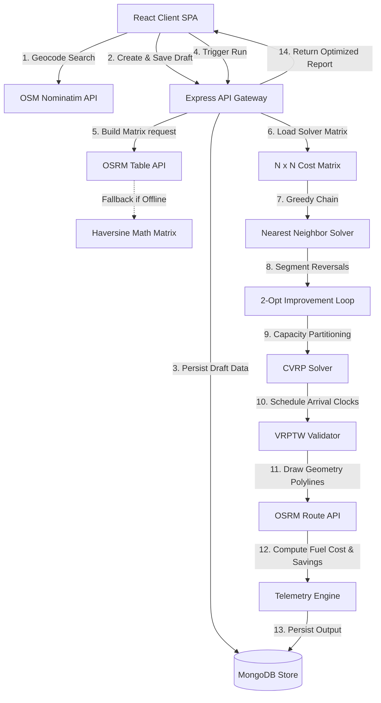

# 📍 RoutePilot — Enterprise Computational Logistics & Routing Solver

<div align="center">
  <p align="center">
    
  </p>
  <h3>Intelligent Logistics, Multi-Vehicle Capacity Routing, and Real-Time Telemetry</h3>
  <p align="center">
    <a href="#"></a>
    <a href="#"></a>
    <a href="#"></a>
    <a href="#"></a>
    <a href="#"></a>
    <a href="#"></a>
    <br />
    <a href="#"></a>
    <a href="#"></a>
    <a href="#"></a>
    <a href="#"></a>
    <a href="#"></a>
  </p>
</div>

---

## 💡 The Problem & The Solution

### ⚠️ The Problem: Computational Route Complexity
Planning delivery schedules manually is a math nightmare. 
* **Traveling Salesperson Problem (TSP)**: Finding the shortest sequence to visit a list of stops scales **factorially** ($O(N!)$). With just 10 stops, there are **3.6 million** possible sequences. At 15 stops, it jumps to **1.3 trillion** routes!
* **Vehicle Routing Problem (VRP)**: When you add weight/load capacities (CVRP) and delivery time slots (VRPTW), the planning task becomes mathematically intractable for humans.
* **Result**: Wasted driver hours, excessive fuel burn, high carbon emissions, and layout overlaps.

### 🚀 The Solution: RoutePilot Optimization
RoutePilot strips away the math complexity, providing a single-click interface that runs advanced metaheuristic optimization solvers. It builds real-world distance tables using street grids, clusters stops based on truck payload constraints, verifies time window compliance, and delivers drive-ready GPS itineraries.

---

## 🛠️ The Core Optimization Engine Pipeline

RoutePilot processes spatial coordinate data through a sequential, high-efficiency pipeline:

```
[ Address Input ] ──> [ Nominatim Geocoding ] ──> [ OSRM Driving Matrix ]
                                                             │
[ Itinerary Output ] <── [ Telemetry Summary ] <── [ Metaheuristic Solver ]
```

### 1. Geographic Matrix Ingestion
Instead of calculating straight-line "crow-flies" distances (which ignore physical terrain, one-way streets, and water barriers), RoutePilot calls the **Open Source Routing Machine (OSRM)**. It compiles an $N \times N$ matrix of true street-grid driving distance and duration values between all coordinates.
* *Local Fallback*: If the OSRM server is offline, the engine falls back to standard **Haversine spherical geometry** to approximate earth-surface distances:
  $$d = 2R \arcsin\left(\sqrt{\sin^2\left(\frac{\Delta\phi}{2}\right) + \cos(\phi_1)\cos(\phi_2)\sin^2\left(\frac{\Delta\lambda}{2}\right)}\right)$$

### 2. Seeding & Greed Chain
Using the distance matrix, RoutePilot creates an initial route sequence starting at the depot ($i = 0$). It systematically scans all unvisited nodes, selects the mathematically nearest unvisited neighbor, transitions to it, and repeats until a complete path is formed.

### 3. 2-Opt Segment Reversals
To refine the greedy path and eliminate crossed lines, the solver executes a **2-Opt local search improvement heuristic**. This algorithm systematically removes two edges from the route and swaps the connection indices, reversing intermediate segments:
* For each pair of indices $i$ and $j$, it reverses the route section from $i$ to $j$:
  $$\text{New Route} = [\text{route}[0..i-1], \text{route}[i..j].\text{reverse}(), \text{route}[j+1..N]]$$
* If the total driving distance of the reversed configuration is shorter, the modification is permanently adopted. This loop runs continuously until no further distance reductions are found.

### 4. Capacity Partitioning (CVRP)
If vehicle cargo limit parameters are enabled, RoutePilot runs a **Capacitated VRP solver**:
* It tracks current vehicle cargo demand against a maximum vehicle capacity weight limit.
* If adding the next nearest node exceeds remaining truck capacity, the solver closes the current sub-route, schedules a depot reload, and initializes a new sub-route starting back at the origin.
* Every isolated sub-route is optimized independently via the 2-Opt loop.

### 5. Time Window Scheduling (VRPTW)
To support time-constrained routes, the scheduling engine simulates driver arrival and departure clocks:
* It sets the starting clock to the user-specified departure time.
* For each stop, it adds the road travel duration from the previous node.
* If arrival occurs prior to `timeWindowStart`, the simulation adds a **waiting driver cost** and adjusts departure index to match the window opening.
* If arrival occurs past `timeWindowEnd`, the stop is flagged as `timeWindowViolated = true`, alerting dispatchers.

---

## 📐 System Architecture Flow

The workflow below illustrates how client planning requests move through geocoders, database schemas, distance matrices, TSP solvers, and route telemetry engines:



---

## ✨ Key Features

* **📍 Geographic Address Search**: Automatic text geocoding via OpenStreetMap Nominatim and current GPS coordinate tracking.
* **🚗 True Road Network Routing**: Interactive maps powered by Leaflet.js and OSRM highway polyline drawing.
* **📦 Vehicle Capacity Constraints (CVRP)**: Dynamic multi-vehicle sub-routing with payload reloading calculations.
* **⏰ Delivery Time Windows (VRPTW)**: Real-time driver schedule tracking, delay indicators, and violation alert flags.
* **📊 Carbon Accounting & Telemetry**: Precise fuel volume, carbon offset indices, and drive-time analytics.
* **📥 Structured Data Export**: One-click download of sequenced itineraries as CSV files or Google Maps navigation links.
* **👤 Premium Navigation & Account UX**: Smooth profile dropdowns, sidebar account drop-ups, and interactive FAQ sections.

---

## ⚙️ Technology Stack

| Layer | Technology | Key Features |
| :--- | :--- | :--- |
| **Frontend Core** | React v18, Vite v6 | Single Page App, fast builds, modular assets. |
| **Styling** | Tailwind CSS v4 | Clean UI layout, glassmorphic cards, responsive typography. |
| **State Store** | Zustand v5 | Lightweight, fast fast-refresh, persisted session store. |
| **Animations** | Framer Motion v11 | Accordion transitions, dropdown animations, path draws. |
| **Mapping** | Leaflet.js, React-Leaflet | Dynamic maps, drag-and-drop coordinates, multi-polyline drawing. |
| **Backend API** | Node.js, Express | JWT auth, error-handling middleware, routing matrices. |
| **Database** | MongoDB, Mongoose | Collections for user profiles, settings, and trip templates. |
| **GIS Services** | OSRM API, Nominatim | High-speed matrices, coordinate geocoding, street polylines. |

---

## 📂 Project Directory Structure

```
RoutePilot/
├── backend/
│   ├── src/
│   │   ├── algorithms/       # Core TSP, CVRP, and 2-Opt solvers
│   │   ├── config/           # Database and environmental setups
│   │   ├── controllers/      # Auth, Trip, and Analytics controllers
│   │   ├── middlewares/      # JWT validation and error boundaries
│   │   ├── models/           # MongoDB Mongoose schemas (User, Trip)
│   │   ├── routes/           # Express router endpoints
│   │   ├── services/         # Geocoding and OSRM API integrations
│   │   └── utils/            # Custom API request/response classes
│   ├── server.js             # Server entry point
│   └── package.json
│
└── frontend/
    ├── src/
    │   ├── api/              # Axios instance and response interceptors
    │   ├── components/       # Reusable layout, map, and graph modules
    │   ├── pages/            # View pages (Planner, Dashboard, FAQ, Settings)
    │   ├── routes/           # React Router public and protected routes
    │   ├── store/            # Auth and Toast stores (Zustand)
    │   ├── utils/            # Unit conversion formatters
    │   ├── index.css         # Styling styles and Tailwind directives
    │   └── main.jsx          # React app entry point
    ├── vite.config.js
    ├── vercel.json           # Vercel SPA routing rewrite rules
    └── package.json
```

---

## 🚀 Installation & Local Development Setup

### Prerequisites
* [Node.js](https://nodejs.org/) (v18 or higher)
* [MongoDB](https://www.mongodb.com/) (Local instance or Atlas cloud database)

### 1. Clone Project
```bash
git clone https://github.com/SauravKumar04/RoutePilot-AI.git
cd RoutePilot-AI
```

### 2. Configure Backend
1. Navigate into the backend directory and install dependencies:
   ```bash
   cd backend
   npm install
   ```
2. Create a `.env` file in the `backend` directory:
   ```env
   PORT=3002
   MONGODB_URI=mongodb+srv://<username>:<password>@cluster.mongodb.net/routepilot
   JWT_SECRET=routepilot_local_fallback_secret_key_3002
   JWT_EXPIRES_IN=7d
   NODE_ENV=development
   OSRM_BASE_URL=http://router.project-osrm.org
   NOMINATIM_BASE_URL=https://nominatim.openstreetmap.org
   ```
3. Start the server using Nodemon:
   ```bash
   npm run dev
   ```

### 3. Configure Frontend
1. Open a new terminal window, navigate to the frontend directory, and install dependencies:
   ```bash
   cd ../frontend
   npm install
   ```
2. Create a `.env` file in the `frontend` directory:
   ```env
   VITE_API_URL=http://localhost:3002/api/v1
   ```
3. Start the Vite server:
   ```bash
   npm run dev
   ```
4. Access the web interface in your browser at `http://localhost:5174`.

---

## 📡 API Endpoint Registry

All backend requests require `Content-Type: application/json`. Protected routes require `Authorization: Bearer <JWT_Token>`.

### Authentication & Preferences
| HTTP Method | Endpoint | Auth | Description |
| :--- | :--- | :--- | :--- |
| `POST` | `/api/v1/auth/register` | None | Register a new user profile. |
| `POST` | `/api/v1/auth/login` | None | Authenticate credentials & return JWT. |
| `PUT` | `/api/v1/auth/preferences` | JWT | Update unit limits, currency, and fuel prices. |

### Trip Planning & Solver Actions
| HTTP Method | Endpoint | Auth | Description |
| :--- | :--- | :--- | :--- |
| `POST` | `/api/v1/trips` | JWT | Create a new trip draft. |
| `GET` | `/api/v1/trips` | JWT | List all trips for current user. |
| `GET` | `/api/v1/trips/:id` | JWT | Retrieve single trip details. |
| `PUT` | `/api/v1/trips/:id` | JWT | Edit trip stops, time windows, and parameters. |
| `DELETE` | `/api/v1/trips/:id` | JWT | Remove trip entry from database. |
| `POST` | `/api/v1/trips/:id/optimize` | JWT | Trigger OSRM matrix calculations and run heuristic solver. |

### Summary & Analytics
| HTTP Method | Endpoint | Auth | Description |
| :--- | :--- | :--- | :--- |
| `GET` | `/api/v1/analytics/summary` | JWT | Retrieve aggregate metrics (mileage saved, CO2 offsets, fuel saved). |

---

## 🛡️ Lint Status & Code Quality

* The codebase maintains **0 ESLint warnings and 0 ESLint errors** to comply with modern clean architecture guidelines.
* Run linter:
  ```bash
  npm run lint
  ```
* Test production build compilation:
  ```bash
  npm run build
  ```
