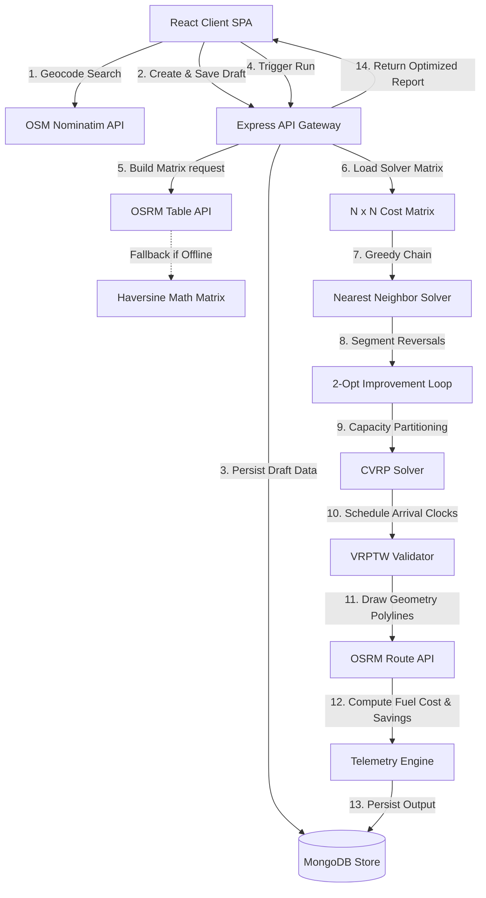

# 📍 RoutePilot — Advanced Computational Logistics & Routing Solver

[](#)
[](#)
[](#)
[](#)
[](#)
[](#)

RoutePilot is a high-performance logistics orchestration platform designed to solve the classical **Traveling Salesperson Problem (TSP)** and **Vehicle Routing Problem (VRP)** for fleet delivery networks. By mapping physical coordinates to a real-world OSRM driving matrix, RoutePilot computes optimized itineraries that eliminate crossed paths, respect delivery time slots, manage truck load limits, and calculate live carbon telemetry.

---

## 🚀 The Core Optimization Engine

As stop counts scale, path combinations grow factorially ($O(N!)$). Manually sequencing routes is mathematically impossible beyond a handful of addresses. RoutePilot automates this via a layered heuristic system:

```
  [Geocoding] ──> [OSRM Road Matrix] ──> [Nearest Neighbor] ──> [2-Opt Swap Loop] ──> [Constraints & Telemetry]
```

### 1. Spatial Matrix Ingestion
Instead of calculating straight-line "crow-flies" distances (which ignore physical road geometry), RoutePilot interfaces with the **Open Source Routing Machine (OSRM)**. It builds an $N \times N$ matrix of true driving distance and duration values between all stops.
* *Offline Fallback*: If OSRM is unreachable, the engine falls back to standard **Haversine spherical geometry** to approximate distances:
  $$d = 2R \arcsin\left(\sqrt{\sin^2\left(\frac{\Delta\phi}{2}\right) + \cos(\phi_1)\cos(\phi_2)\sin^2\left(\frac{\Delta\lambda}{2}\right)}\right)$$

### 2. Nearest Neighbor Seeding
To begin the Traveling Salesperson calculation, RoutePilot creates an initial route starting at the depot ($i = 0$). It systematically scans all unvisited nodes, selects the mathematically nearest unvisited neighbor, transitions to it, and repeats until a complete path is formed.

### 3. 2-Opt Untangling Iteration
The initial route is refined using a **2-Opt local search improvement heuristic**. This algorithm systematically removes two edges from the route and swaps the connection indices, reversing intermediate segments:
* For each pair of indices $i$ and $j$, it reverses the route section from $i$ to $j$:
  $$\text{New Route} = [\text{route}[0..i-1], \text{route}[i..j].\text{reverse}(), \text{route}[j+1..N]]$$
* If the total driving distance of the reversed configuration is shorter, the modification is permanently adopted. This loop runs continuously until no further distance reductions are found.

### 4. Capacitated Vehicle Routing (CVRP)
When vehicle capacity limits are enabled, RoutePilot transitions from a standard TSP model to a **CVRP heuristic**:
* It tracks current vehicle cargo demand against a maximum vehicle capacity weight limit.
* If adding the next nearest node exceeds remaining truck capacity, the solver closes the current sub-route, schedules a depot reload, and initializes a new sub-route starting back at the origin.
* Every isolated sub-route is optimized independently via the 2-Opt loop.

### 5. Time Window Scheduling (VRPTW)
To support time-constrained routes, the scheduling engine simulates driver arrival and departure clocks:
* It sets the starting clock to the user-specified departure time.
* For each stop, it adds the road travel duration from the previous node.
* If arrival occurs prior to `timeWindowStart`, the simulation adds a **waiting driver cost** and adjusts departure index to match the window opening.
* If arrival occurs past `timeWindowEnd`, the stop is flagged as `timeWindowViolated = true`, alerting dispatchers.

---

## 🎨 System Architecture Flow

The workflow below illustrates how client planning requests move through geocoders, database schemas, distance matrices, TSP solvers, and route telemetry engines:



---

## ⚡ Key Features

* **Interactive Waypoint Workspace**: Add stops by address search or GPS coordinates. Specify service times, demands, and window constraints per location.
* **Bi-Directional Optimization Profiles**:
  * **One-Way Routing**: Sequences stops along the shortest line from start to finish.
  * **Round Trip Routing**: Cycles through all waypoints and routes the vehicle back to origin.
* **Premium Telemetry Dashboard**: Visualizes historical mileage saved, efficiency indices, and fuel capital retained.
* **Deep-Link Navigation Export**: Bundles optimized itineraries into native Google Maps multi-stop navigate links.
* **Structured Exporting**: Download detailed route logs and geocoded coordinates to CSV files.

---

## 📂 Project Directory Layout

```
RoutePilot/
│
├── backend/
│   ├── src/
│   │   ├── algorithms/       # Core TSP, CVRP, & 2-Opt solvers
│   │   ├── config/           # Database integration setup
│   │   ├── controllers/      # Route controllers (Auth, Trips, Analytics)
│   │   ├── middlewares/      # JWT authentication and error boundaries
│   │   ├── models/           # MongoDB schemas (User, Trip)
│   │   ├── routes/           # Express endpoint router mappings
│   │   ├── services/         # OSRM Geocoding and Routing API clients
│   │   └── utils/            # Helper classes (ApiError, ApiResponse)
│   ├── server.js             # Server entry point
│   └── package.json
│
└── frontend/
    ├── src/
    │   ├── api/              # Axios request hooks and interceptors
    │   ├── components/
    │   │   ├── analytics/    # Recharts telemetry graphs
    │   │   ├── common/       # Modals, inputs, and navigation elements
    │   │   ├── dashboard/    # Workspace overview widgets
    │   │   ├── layout/       # Navigation panels and sidebar
    │   │   └── map/          # Leaflet.js interactive maps
    │   ├── pages/            # View pages (TripPlanner, Details, Settings)
    │   ├── routes/           # React Router paths & Auth filters
    │   ├── store/            # Lightweight Zustand store
    │   ├── utils/            # Formatters (currency, distance, durations)
    │   ├── index.css         # CSS stylesheets importing Tailwind v4
    │   └── main.jsx          # React app mount root
    ├── vite.config.js
    ├── vercel.json           # Vercel SPA routing configurations
    └── package.json
```

---

## ⚙️ Installation & Development Setup

### Prerequisites
* [Node.js](https://nodejs.org/) (v18 or higher)
* [MongoDB](https://www.mongodb.com/) (Local instance or Atlas cloud account)

### 1. Project Ingestion
Clone the repository files to your local system:
```bash
git clone https://github.com/SauravKumar04/RoutePilot-AI.git
cd RoutePilot-AI
```

### 2. Backend Installation & Configurations
1. Navigate into the backend directory and install dependencies:
   ```bash
   cd backend
   npm install
   ```
2. Create a `.env` file in the `backend` directory containing the following:
   ```env
   PORT=5000
   MONGODB_URI=mongodb+srv://<username>:<password>@cluster.mongodb.net/routepilot
   JWT_SECRET=routepilot_local_fallback_secret_key_3002
   JWT_EXPIRES_IN=7d
   NODE_ENV=development
   OSRM_BASE_URL=http://router.project-osrm.org
   NOMINATIM_BASE_URL=https://nominatim.openstreetmap.org
   ```
3. Start the Express development server:
   ```bash
   npm run dev
   ```

### 3. Frontend Installation & Configurations
1. Open a new terminal window, navigate to the frontend directory, and install dependencies:
   ```bash
   cd ../frontend
   npm install
   ```
2. Create a `.env` file in the `frontend` directory:
   ```env
   VITE_API_URL=http://localhost:5000/api/v1
   ```
3. Start the Vite server:
   ```bash
   npm run dev
   ```
4. Access the web interface at `http://localhost:5173`.

---

## 📡 API Route Matrix

All requests require a `Content-Type: application/json` header. Protected endpoints require `Authorization: Bearer <JWT_Token>`.

### Authentication & Account
| HTTP Method | Endpoint | Auth | Description |
| :--- | :--- | :--- | :--- |
| `POST` | `/api/v1/auth/register` | None | Register a new planner account. |
| `POST` | `/api/v1/auth/login` | None | Authenticate credentials & return token. |
| `PUT` | `/api/v1/auth/preferences` | JWT | Update localization, currency, and efficiency settings. |

### Route Planning & Operations
| HTTP Method | Endpoint | Auth | Description |
| :--- | :--- | :--- | :--- |
| `POST` | `/api/v1/trips` | JWT | Create a new route draft. |
| `GET` | `/api/v1/trips` | JWT | Retrieve all route lists. |
| `GET` | `/api/v1/trips/:id` | JWT | Retrieve specific trip details. |
| `PUT` | `/api/v1/trips/:id` | JWT | Update draft stops or configurations. |
| `DELETE` | `/api/v1/trips/:id` | JWT | Remove trip ledger record. |
| `POST` | `/api/v1/trips/:id/optimize` | JWT | Run the heuristic routing solver on a draft. |

### Analytics
| HTTP Method | Endpoint | Auth | Description |
| :--- | :--- | :--- | :--- |
| `GET` | `/api/v1/analytics/summary` | JWT | Retrieve aggregated mileage, cost, and efficiency telemetry. |

---

## 🚀 Production Deployment on Vercel

The frontend is fully configured for deployment on Vercel. Because RoutePilot is a Single Page Application (SPA), the custom `vercel.json` rewrite rule is automatically configured to map routes back to the main document root to prevent routing errors:

```json
{
  "cleanUrls": true,
  "rewrites": [
    {
      "source": "/((?!assets/|favicon.svg|icons.svg).*)",
      "destination": "/index.html"
    }
  ]
}
```

### Steps to Deploy:
1. Push your code changes to GitHub.
2. In the Vercel Dashboard, select **New Project** and import the repository.
3. If deploying from a monorepo structure, set the **Root Directory** field to `frontend`.
4. Configure the environment variable:
   * Key: `VITE_API_URL`
   * Value: `https://your-backend-api-url.com/api/v1`
5. Click **Deploy**.
